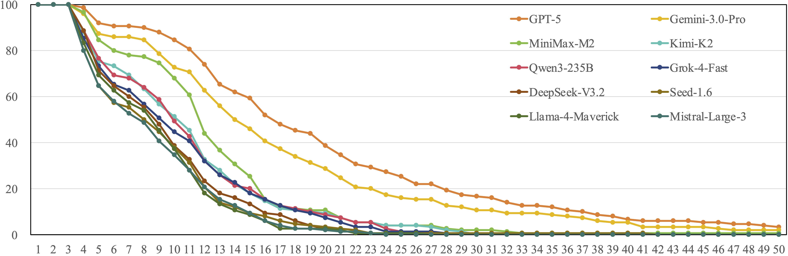
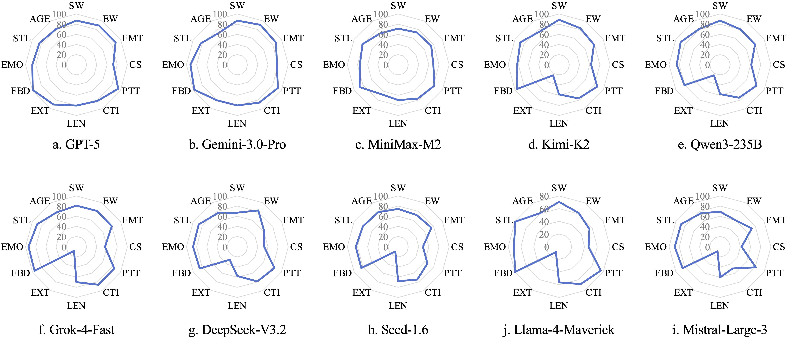

<div align= "center">
    <h1 align="center"><i>One Battle After Another:</i><br> Probing LLMs' Limits of Multi-Turn Instruction Following with an Evolving Benchmark</h1>
</div>


> Note: This repository is still under construction. 

<div align= "center">
<p>
<a href="https://arxiv.org/abs/2511.03508v2">📖 Arxiv</a> |
<!-- <a href="https://huggingface.co/datasets/ASCIIEval/ASCIIEval">🤗 ASCIIEval Dataset</a> |
<a href="https://huggingface.co/datasets/ASCIIEval/ASCIITune">🤗 ASCIITune Dataset</a>
 <a href="https://asciieval.github.io/">🌐 Website</a> -->
</p>
</div>

# Introduction

Evaluating LLMs' instruction-following ability in multi-topic dialogues is essential yet challenging. Existing benchmarks are limited to a fixed number of turns, susceptible to saturation, and fail to capture users' interactive experience. In this work, we propose a novel framework backed by a three-layer tracking mechanism and a query synthesis agent to mimic sequential user behaviors. Incorporating Flow Theory, we introduce process-centric metrics and terminate a conversational evaluation only upon exhausting user patience. Building on this framework, we present EvolIF, an evolving benchmark covering 12 constraint groups. Results indicate that GPT-5 excels, sustaining 14 turns with 66.40% robustness. It outperforms Gemini-3.0-Pro by a margin of 5.59%, while other models trail behind.

# File Structure

- **data/**: Seed materials.
  - **input_data_modified_keywords_v2.jsonl**: Topics with corresponding keywords.
  - **persona_language_styles_500.jsonl**: Different personas with corresponding style descriptions.
- **state/**: Evolving internal states and snapshots during benchmark construction.
  - **state_0.json**: Aggregated context states after specified steps for traceability and reproduction; includes constraints, topics, and instructions.
  - **snapshots_0.jsonl**: Step-wise state trajectory (JSON Lines).
- **dialog/**: Synthesized multi-turn user–LLM dialogs based on `state`.
  - **dialog_1.jsonl**: Dialog samples (JSON Lines) consumed by evaluation.
- **evaluation/**: Model-specific evaluation outputs and raw results.
  - Subdirectories are grouped by model name (e.g., `deepseek-chat/`, `gpt-5-2025-08-07/`, `grok-4-fast-reasoning/`).
  - Each subdirectory contains **eval_1.jsonl**: Raw evaluation results for that model.
- **src/**: Core code for benchmark construction, query synthesis, evaluation, and scoring.
  - **data_utils/**: Prompts and helpers used by query synthesis.
  - **instruction/**: Constraint definitions and instruction-check utilities.
  - **state.py**: State representation + update/transition logic used during construction.
  - **main.py**: Generate evolving user internal states and save to `state/`.
  - **query_synthesis.py**: Synthesize multi-turn dialogs from `state/` into `dialog/`.
  - **eval.py**: Run model evaluation on `dialog/` and write raw results to `evaluation/`.
  - **score.py**: Compute metrics and summarize results from `evaluation/`.

# Usage

## Installation

Clone this repo into your working directory and set up the environment:

```python
git clone xxx
cd EvolvingInstructionFollowing
conda create -n evolif python=3.10
conda activate evolif
pip install -r requirements.txt
```

Major requirements are listed in `requirements.txt`. 

## Benchmark Construction

```python

# Generate user intentions from scratch
python3 src/main.py --steps 100 --output_dir ./state --start_id 0 --end_id 10

# Synthesize user queries
python3 src/query_synthesis.py --input_dir ./state --output_dir ./dialog --start_id 0 --end_id 10 --api_key xxx --base_url xxx
```

**Manual review note**: Please check whether any synthesized samples fail the checker. If `user_query_verified` is empty, manually inspect and fix the corresponding sample before proceeding to the evaluation stage.

## LLM Evaluation

```python
# Evaluate model
python3 src/eval.py --dialog_dir ./dialog --output_dir ./evaluation --start_id 0 --end_id 10 --model_name xxx --api_key xxx --base_url xxx --patience 3

# Calculate and print results
python3 src/score.py --input_dir ./evaluation/xxx
```

## Customizing / Extending Constraints

You can add new constraints under `src/instruction/`. **Each constraint corresponds to a class** (inheriting from `Instruction`) and typically includes:
- **`id`**: A unique string identifier (e.g., `startwith` / `format`).
- **`args`**: Parameters of the constraint (must be JSON-serializable so they can be stored in `state/` and `dialog/`).
- **Core methods**:
  - `initialization(...)`: Initialize/sample parameters (and optionally reconstruct from existing `args`).
  - `build_description()`: Generate a natural-language constraint description shown to the model (used to construct dialogue instructions).
  - `modification(...)`: Randomly modify parameters based on the current state (used in the evolving process).
  - `check_following(...)`: The checker that determines whether a model output satisfies the constraint (some constraints such as `emotion/reader_age/style` may call an LLM as a judge).
  - `check_query_completeness(query, prev_args, cur_args)`: Determine whether the synthesized `user_query_verified` fully and correctly expresses the constraint.

**Selecting/combining constraints**: In `src/state.py`, use `INSTRUCTION_DICT / INSTRUCTION_WEIGHT_DICT / INSTRUCTION_REMOVE_DICT` to control the available constraint set and sampling weights; in `src/eval.py`, use `_ID_TO_CLASS` to define which constraints are recognized during evaluation (when adding a new constraint, register it in both places).

# EvolIF

## Data

Please stay tuned for the upcoming release of the test data and evaluation results.

## Leaderboard

| Models | EDR<sub>len</sub> | EDR<sub>acc</sub> | EDR<sub>succ</sub> | EDR<sub>lss</sub> | CSR (%) | ISR (%) | REC (%) | ROB (%) |
| :--- | :--- | :--- | :--- | :--- | :--- | :--- | :--- | :--- |
| **GPT-5** | **19.32** | **17.11** | **14.09** | **8.80** | **88.57** | **72.91** | **29.09** | **66.40** |
| **Gemini-3.0-Pro** | <u>16.36</u> | <u>14.11</u> | <u>11.41</u> | <u>7.17</u> | <u>86.22</u> | <u>69.72</u> | <u>27.50</u> | <u>60.81</u> |
| MiniMax-M2 | 11.75 | 9.19 | 7.17 | 4.77 | 78.22 | 60.98 | 24.29 | 54.54 |
| Kimi-K2 | 10.16 | 7.82 | 5.99 | 4.13 | 76.92 | 58.99 | 19.52 | 48.43 |
| Qwen3-235B | 10.02 | 7.66 | 5.80 | 3.97 | 76.43 | 57.88 | 21.15 | 47.47 |
| Grok-4-Fast | 9.52 | 7.29 | 5.50 | 4.13 | 76.58 | 57.77 | 16.01 | 46.03 |
| DeepSeek-V3.2 | 8.64 | 6.32 | 4.62 | 3.38 | 73.15 | 53.47 | 15.87 | 44.42 |
| Seed-1.6 | 8.21 | 5.78 | 4.20 | 2.95 | 70.44 | 51.18 | 15.90 | 39.43 |
| Llama-4-Maverick | 8.10 | 5.21 | 3.90 | 2.76 | 64.37 | 48.15 | 19.05 | 39.37 |
| Mistral-Large-3 | 7.86 | 5.37 | 3.91 | 2.83 | 68.34 | 49.70 | 15.79 | 38.56 |


## Dialogue Survival Curves

<div align="center">
  
</div>

## Constraint-level Performance Profiles

<div align="center">
  
</div>


# Citation

```
@misc{jia2025battleanotherprobingllms,
      title={One Battle After Another: Probing LLMs' Limits on Multi-Turn Instruction Following with a Benchmark Evolving Framework}, 
      author={Qi Jia and Kaiwei Zhang and Xiujie Song and Ye Shen and Xiangyang Zhu and Guangtao Zhai},
      year={2025},
      eprint={2511.03508v2},
      archivePrefix={arXiv},
      primaryClass={cs.CL},
      url={https://arxiv.org/abs/2511.03508v2}, 
}
```
